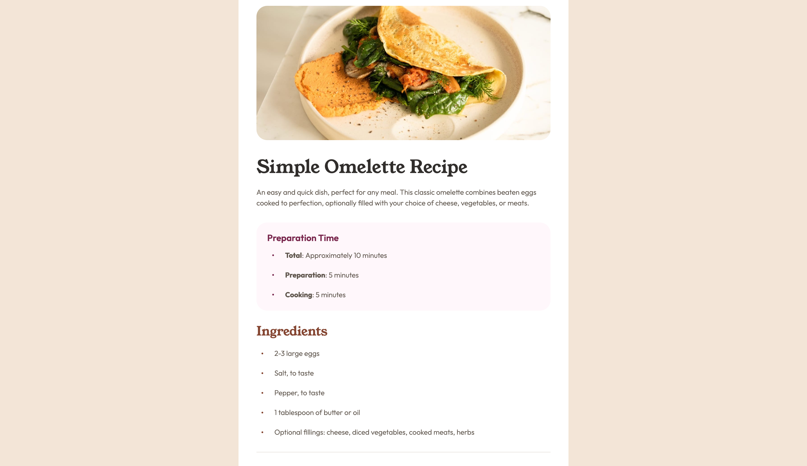

# Frontend Mentor - Recipe page solution

This is a solution to the [Recipe page challenge on Frontend Mentor](https://www.frontendmentor.io/challenges/recipe-page-KiTsR8QQKm). Frontend Mentor challenges help you improve your coding skills by building realistic projects.

## Table of contents

- [Overview](#overview)
  - [The challenge](#the-challenge)
  - [Screenshot](#screenshot)
  - [Links](#links)
- [My process](#my-process)
  - [Built with](#built-with)
  - [What I learned](#what-i-learned)
  - [Continued development](#continued-development)
  - [Useful resources](#useful-resources)
- [Author](#author)

## Overview

### Screenshot

### Links

- Solution URL: [Add solution URL here](https://your-solution-url.com)
- Live Site URL: [Add live site URL here](https://your-live-site-url.com)

## My process

### Built with

- Semantic HTML5 markup
- CSS custom properties
- Flexbox
- Mobile-first workflow

### What I learned

I spent a lot of time to make the whole thing responsive, and I'm satisfied with the result. The page works perfectly on desktop, tablet and phone.

### Continued development

Altough the page works pretty good on any device screens, I'm sure, that many technics I used are amateur, and wont work well in bigger projects. Cant wait to improve myself in the topic of responsive design.

### Useful resources

- [ChatGPT](https://chatgpt.com) - Without ChatGPT the whole think gonna be a huge timeconsuming struggle, but this AI is perfect for frontend design. I love because it doesn't just give me a perfect solution to the different problems, but also explains the why-s.

## Author

- Frontend Mentor - [@L4r4TW](https://www.frontendmentor.io/profile/L4r4TW)
- Twitter - [@L4r4TW](https://x.com/L4r4TW)
- Linkedin - [Bruno Banoczi](https://www.linkedin.com/in/bruno-banoczi-csernak/)
